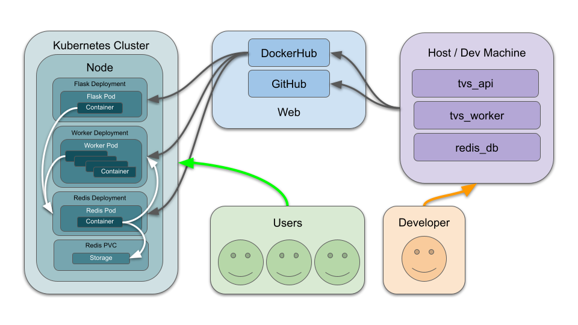

# Location Based Severe Weather App

### Overview

#### Data available at: https://www.ncei.noaa.gov/pub/data/swdi/database-csv/v2/
This web app uses a combination of Flask, Redis, Leaflet, and Kubernetes to provide an interactive service for summarizing severe weather data in a specific area.
These statistics are from 2006 to 2016, and are provided in `.csv.gz` format from NOAA's NCEI.

### Scripts
| Script              | Description                                        |
|---------------------|----------------------------------------------------|
| `api.py`              | Manages Flask API                                  |
| `redis_handler.py`    | Manages data, jobs, and results databases          |
| `worker.py`           | Runs polygon intersection functions to filter relevant data and provide graphs |
| `test_api.py`         | Test file for api.py                               |
| `test_redis_handler.py` | Test file for redis_handler.py                     |
| `test_worker.py`     | Test file for worker.py                            |

### Running the Code

#### Deployment
##### Local
##### Kubernetes

#### Usage
##### Local
##### Public

### Flask Interaction
You can interact with the flask app via `curl localhost:5000/<route>` once it is up and running.

| Route            | Method   | Description                                 |
|------------------|----------|---------------------------------------------|
| `/`              | `GET`    | Returns index.html (webpage)                |
| `/help`          | `GET`    | Returns help infromation as text            |
| `/data`          | `GET`    | Returns all data from Redis                 |
| `/data`          | `POST`   | Retrieves data from NOAA’s NCEI website     |
| `/data`          | `DELETE` | Deletes all data from Redis                 |
| `/jobs`          | `GET`    | Returns all job IDs                         |
| `/jobs`          | `POST`   | Posts a new job to Redis and returns job ID |
| `/jobs/<jid>`    | `GET`    | Returns information for a specific job ID   |
| `/results/<jid>` | `GET`    | Returns results from a specific job ID      |

### Interpretation
Returned data includes summary statistics for four types of severe weather events:

| Warning Type          | Description                                                                                       |
|-----------------------|---------------------------------------------------------------------------------------------------|
| FLASH FLOOD           | Issued when rapidly rising water poses an immediate hazard to life and property. |
| SPECIAL MARINE        | Warnings specifically tailored for marine interests (boats, shipping), to alert them to hazardous marine conditions such as strong winds, high waves, and thunderstorms. |
| SEVERE THUNDERSTORM   | A thunderstorm characterized by one or more of the following: large hail (1 inch or greater in diameter), damaging winds (58 mph or greater), and/or tornadoes. |
| TORNADO               | A violently rotating column of air in contact with the ground and extending from a thunderstorm cloud, capable of causing extreme damage and posing a serious threat to life and property. |

This data is to be interpreted as the occurrence over time of these events, and should be used to better understand what typical severe conditions look like for a specific, user-defined area.
For example, buildings created in areas prone to flash flood warnings should be engineered to survive different degrees of flooding.
Similarly, areas prone to tornado warnings should encourage the inclusion of tornado shelter areas in new buildings.
These are pieces of information that should be extremely useful to civil and architectural engineers when scouting for, designing, and implementing new structures.

### Diagram

