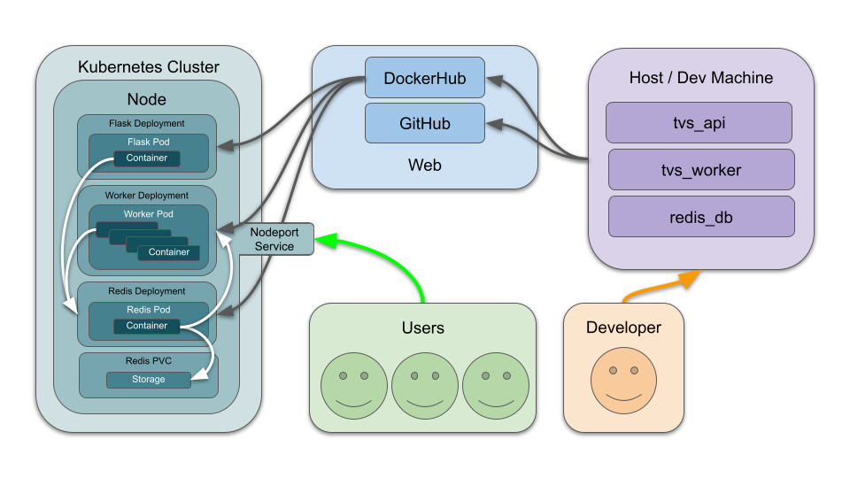

# Location Based Severe Weather App

### Overview

Data available at: https://www.ncei.noaa.gov/pub/data/swdi/database-csv/v2/

### Scripts

### Running the Code
#### Non-Containerized

#### Containerized

### Flask Interaction
You can interact with the flask app via `curl localhost:5000/<route>` once it is up and running.

| Route     | Method | Description                                  |
|-----------|--------|----------------------------------------------|
| `/`         | `GET`    | Returns index.html (webpage)                 |
| `/data`     | `GET`    | Returns all data from Redis                  |
| `/data`     | `POST`   | Retrieves data from NOAA’s NCEI website      |
| `/data     | `DELETE` | Deletes all data from Redis                  |
| `/jobs`     | `GET`    | Returns all job IDs                          |
| `/jobs`     | `POST`   | Posts a new job to Redis and returns job ID |
| `/jobs/<jid>` | `GET`   | Returns information for a specific job ID    |
| `/results/<jid>` | `GET` | Returns results from a specific job ID       |

### Interpretation

### Diagram

